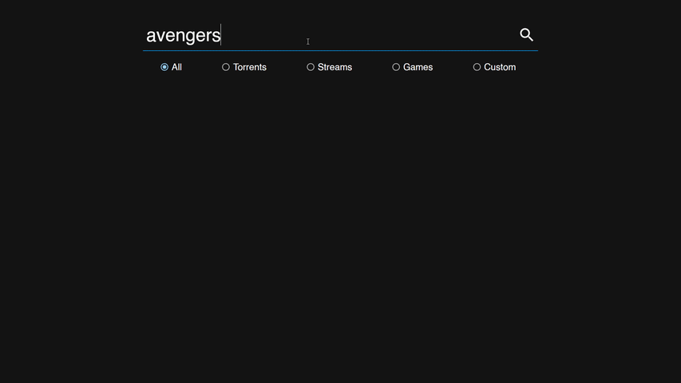
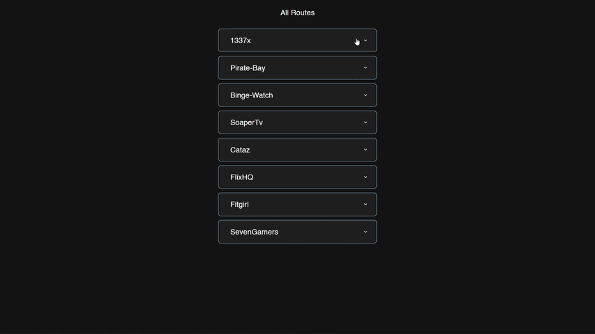

<h1 align="center">Hi 👋, I'm Daniel.</h1>

- <h4>🍀 This is a cluster search tool for downloading/streaming Torrents, Movies, Games etc...</h4>
- <h4>🐳 This REACT app uses Scrapy (a JSON based web-scrapper) as it's backend for scrapping mulitple site simultaneously</h4>
- <h4>🐉 Languages & Frameworks used :</h4>
    
    
    
    
    
    

<h2>How it looks</h2>
<h4>Normal Search</h4>

<h4>Custom Search</h4>

<h4>Testing Custom Scrape Tasks ("/status" route)</h4>

